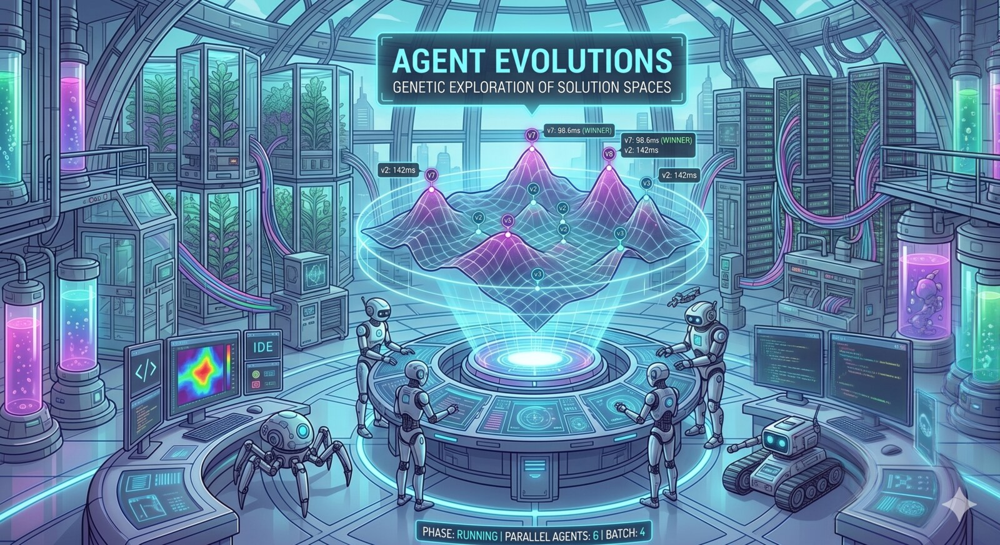

# Agent Evolutions

[](https://github.com/fmind/agent-evolutions/actions/workflows/ci.yml) [](./LICENSE) [](https://github.com/anthropics/claude-code) [](https://github.com/google-gemini/gemini-cli) [](https://github.com/features/copilot)



> **Genetic exploration of solution spaces, with verifiable scoring.**

**Agent Evolutions** is a file-based Agent Skill suite that drives a coding agent through a genetic loop: gather a single verifiable objective, generate variants in parallel batches, learn from each generation, rank survivors by exit codes (gates) and numeric measures (rubric), then port the winner into the repo. Three slash commands — `/new-agent-evolution`, `/run-agent-evolution`, `/apply-agent-evolution` — cover the three phases, each enforcing its preconditions on `evolution.yaml` field presence. Install once and the same `skills/` tree runs in Claude Code, Gemini CLI, and GitHub Copilot.

**The payoff:** when you have an optimization that admits multiple plausible designs and at least one mechanical measure (faster, smaller, more accurate, more autonomous), the agent runs a budgeted genetic search instead of you guessing — and reports a winner you can defend with evidence.

## Why this exists

Picking a design by intuition is fast but wrong often enough to cost weeks downstream. Three patterns this skill suite replaces:

- "Which prompt wins?" answered by a 5-minute eyeball test rarely survives production.
- "Which library shape is friendlier?" answered by personal taste loses to whichever shape has empirical evidence.
- "Which caching strategy is fastest?" needs a benchmark, not a vote.

Agent Evolutions flips the default: pin the objective up front, freeze the gates and rubric, generate variants in adaptive batches, and let the leaderboard pick the winner.

## What you get

- **Evidence over opinion.** Every claim about which variant wins is backed by an independent shell-exit gate and a numeric rubric measure. No silent retries; no result-driven criteria; no narrative scoring.
- **Genetic loop with adaptive batches.** Generation 1 seeds diverse hypotheses. Each later generation mutates top survivors, crosses them over, and injects fresh exploration variants — sized to `budget.parallel` so the loop _learns_ between batches instead of fanning out blindly.
- **Hard gates + numeric rubric.** Variants failing any gate are excluded from ranking. Rubric axes are numeric with `direction` (minimize | maximize) and `weight`. Composite score is a rank-normalized weighted mean across axes — robust to outliers and recomputed on read by the run skill, never persisted in `evolution.yaml`.
- **Self-contained variants.** Each `variants/v<n>/workspace/` is an isolated checkout (`git worktree`) or file copy. Every variant starts from `HEAD`; genetic lineage lives in `parents[]`, not in compounded file state.
- **File-based sub-agent contract.** Each variant sub-agent writes `variants/v<n>/result.json` (validated against `result.schema.json`). The parent reads files, not chat — survives crashes, gives a permanent audit trail, no JSON-in-chat parsing.
- **Resumable, budget-bounded.** `evolution.yaml` is the single source of truth. State is derived from field presence (no step machine, no pause flag) — the agent re-reads on entry and decides what to do. Budget caps cover total variants, parallel concurrency, wall clock, and score plateau.
- **Three commands, three phases.** `/new-agent-evolution` captures the brief, `/run-agent-evolution` drives the genetic loop, `/apply-agent-evolution` lands the winner. Each refuses to run outside its phase based on `evolution.yaml` field presence — no accidental re-capture, no apply-before-winner. Apply diffs the winner workspace against the live tree, gets explicit user confirmation, copies files in, optionally re-runs gates against the repo. Excluded paths from `scope.exclude` are refused even if the variant touched them.
- **Install once, use anywhere.** The same `skills/` tree drives Claude Code, Gemini CLI, and GitHub Copilot.

## The skills

| Phase   | Trigger                        | Owns                                                                                                                                                                             |
| ------- | ------------------------------ | -------------------------------------------------------------------------------------------------------------------------------------------------------------------------------- |
| Capture | `/new-agent-evolution <title>` | Discuss objective, gates, rubric, scope, budget. Commit `.agents/evolutions/<id>-<slug>/` on agreement.                                                                          |
| Run     | `/run-agent-evolution <id>`    | Genetic loop: plan batch → dispatch parallel sub-agents → ingest each `result.json` → score on read → adapt or stop. Writes `winner` when budget / cap / plateau / no-survivors. |
| Apply   | `/apply-agent-evolution <id>`  | Diff winner workspace vs live repo, confirm, copy in, optional post-apply gates. Writes `applied`.                                                                               |

State is derived from `evolution.yaml` field presence:

```text
empty variants → ready
has variants, no winner → running
has winner, no applied → evaluated
has applied → done
```

## Walkthrough

```text
$ /new-agent-evolution "optimize cli startup"
  → asks for objective, gates, rubric, scope, budget; proposes a draft
  → on "looks good", writes evolution.yaml + EVOLUTION.md

$ /run-agent-evolution 1
  → gen 1: plans 6 diverse seeds (lazy-load, build-time inline, plugin map, polyfill strip, ...)
  → spawns 6 sub-agents in parallel; each materializes a worktree, implements, writes result.json
  → ranks: v2 (build-time inline) leads at 142 ms, v1 (lazy-load) at 184 ms, v4 fails G2
  → gen 2: mutates v2 ("v2 + tree-shake help chunk") and v1, crosses v2×v3, adds 1 explore
  → ...
  → plateau at gen 4 — top score unchanged for 2 gens; stops at 24/30 evaluated
  → winner: v7 (98.6 ms)

$ /apply-agent-evolution 1
  → diffs variants/v7/workspace vs live src/, tsdown.config.ts, package.json
  → "Confirm to apply, or reply abort"
  → user: "looks good"
  → copies files; runs G1 + G2 against live repo; both green
```

## Install

### Claude Code

```text
/plugin marketplace add fmind/agent-evolutions
/plugin install agent-evolutions@agent-evolutions
```

For local development, point the marketplace at a clone:

```text
/plugin marketplace add /path/to/agent-evolutions
/plugin install agent-evolutions@agent-evolutions
```

### Gemini CLI

```bash
gemini extensions install fmind/agent-evolutions
```

For local development (live-link, edits reload on next session):

```bash
gemini extensions link /path/to/agent-evolutions
```

### GitHub Copilot

```bash
copilot plugin marketplace add fmind/agent-evolutions
copilot plugin install agent-evolutions@agent-evolutions
```

VS Code — point `chat.pluginLocations` at a local clone:

```jsonc
// settings.json
"chat.pluginLocations": {
  "/path/to/agent-evolutions": true
}
```

## Reference

### Layout

```text
agent-evolutions/
├── AGENTS.md                                # canonical context — read by Copilot; @-included by CLAUDE.md / GEMINI.md
├── evolution.schema.json                    # JSONSchema for end-user evolution.yaml
├── result.schema.json                       # JSONSchema for per-variant result.json (sub-agent contract)
├── skills/new-agent-evolution/SKILL.md      # Capture phase — discuss & seed the brief
├── skills/run-agent-evolution/SKILL.md      # Run phase — drive the genetic loop, pick the winner
├── skills/apply-agent-evolution/SKILL.md    # Apply phase — diff, confirm, copy in
├── examples/evolutions/                     # runnable walkthroughs
├── .claude-plugin/                          # Claude Code plugin manifest + bundled marketplace
├── gemini-extension.json                    # Gemini CLI extension manifest
├── plugin.json                              # GitHub Copilot manifest
└── .github/workflows/ci.yml                 # lint via pre-commit
```

In an end-user project after the Capture phase (`/new-agent-evolution <title>`):

```text
.agents/evolutions/<id>-<slug>/
├── evolution.yaml                           # machine state — validated against evolution.schema.json
├── EVOLUTION.md                             # single human/agent surface: TL;DR, Brief (loaded verbatim by every variant), Variants, Results
└── variants/v<n>/
    ├── workspace/                           # one isolated workspace per variant (gitignored by default)
    └── result.json                          # sub-agent output, validated against result.schema.json
```

### When this skill suite does not apply

- The task is a one-line bug fix, rename, or doc edit. Just do it.
- There is no reasonable way to verify the result mechanically, even via a measurable proxy. Use a normal review instead.
- The user has already decided the design and is asking for implementation. Implement it.

If success criteria cannot be expressed as a shell exit code (gate) or a number (rubric), the skill pushes back: "we need at least one mechanical check before variants make sense." Help write one before continuing.

## Contributing

Issues and PRs welcome. Three house rules to keep the skills lean:

- **Each skill file has a line cap** (see `AGENTS.md` §Conventions) — every SKILL.md loads into agent context on every run, so verbosity costs budget.
- **Voice is imperative.** The skill body addresses the agent ("Read X, then write Y."), not a human reader — that prose belongs in this README.
- **Run `npm install` once after cloning** — pulls in Prettier and markdownlint-cli2 (no runtime deps). Then `npm run lint` validates Prettier + markdownlint locally with the same hooks `pre-commit` and CI run.

## License

MIT — see [LICENSE](./LICENSE).
